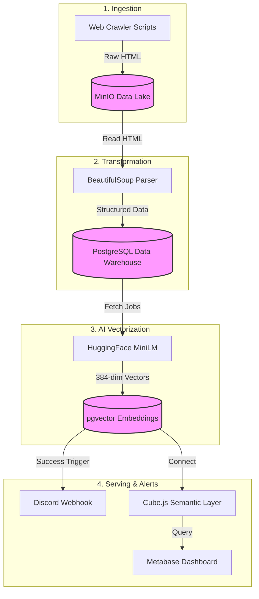
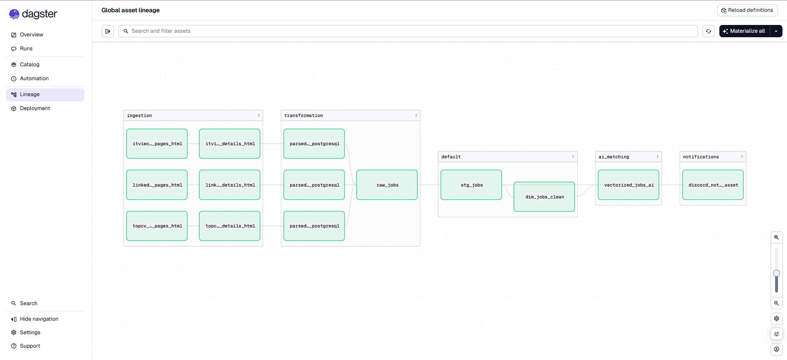
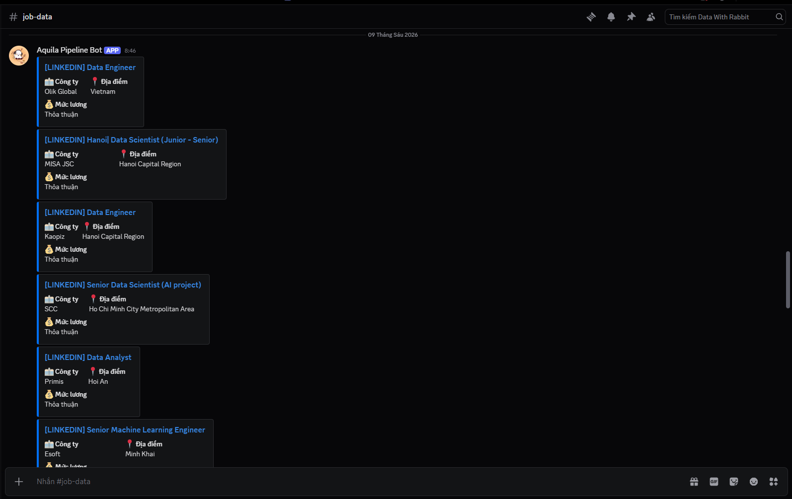
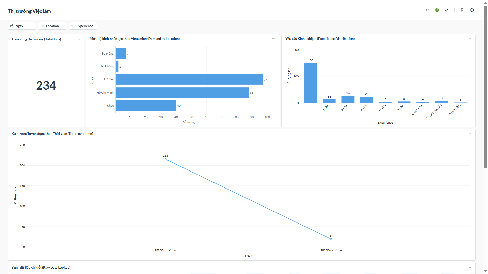
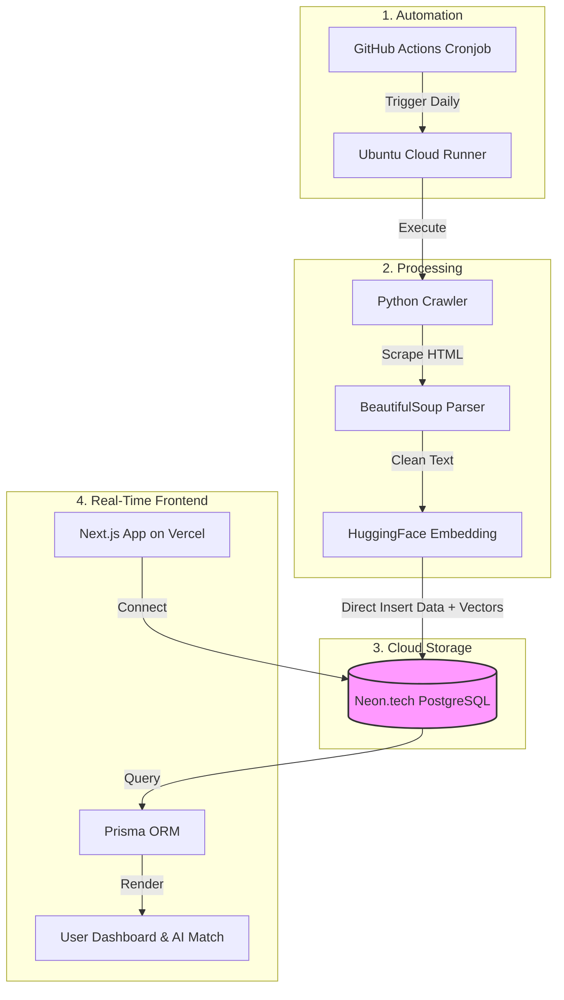

# 🦅 Crawl Job Data Pipeline (MDS 2.0)

<div align="center">
  <!-- Core -->
  
  
  
  
  
  
  <br />
  <!-- Local Flow 1 -->
  
  
  
  
  
  
</div>

<br />

A completely automated, end-to-end Data Engineering & AI Platform that crawls IT
job postings, generates vector embeddings for Semantic Search (AI Match), and
presents them on a blazing-fast Next.js dashboard.

---

## 🏗 System Architectures

The system is designed with two distinct architectures, serving different
operational needs.

### 1. Local Architecture (Data Mesh with Dagster & Docker)

This is the foundational architecture built on the Data Mesh model, utilizing
Enterprise-standard tools. This architecture is suitable for deployment on a
Local Server or a personal machine for development and research.

**End-to-End Flow:**



1. **Ingestion (Raw Data Crawling):**
   - Dagster runs crawl pipelines targeting job portals (TopCV, LinkedIn).
   - Raw HTML data is immediately ingested into **MinIO Object Storage** (Data
     Lake).
2. **Transformation (Data Parsing):**
   - Dagster reads the HTML back from MinIO, utilizing `BeautifulSoup` to parse
     specific fields (Title, Salary, Description, Requirements...).
   - The parsed data is loaded into the `raw_jobs` table in **PostgreSQL** (Data
     Warehouse).
3. **AI Vectorization (Semantic Vector Embedding):**
   - The `vectorized_jobs_ai` asset in Dagster reads from the `raw_jobs` table.
   - We utilize the HuggingFace `all-MiniLM-L6-v2` model to encode job
     descriptions into 384-dimensional vectors.
   - The database's `embedding` field is updated using the `vector(384)` type
     from the `pgvector` extension.
4. **Notification (Discord Alerts):**
   - Immediately after the vectorization pipeline finishes, Dagster triggers the
     `discord_notification_asset`.
   - A bot automatically aggregates the newly collected jobs and pushes a
     detailed alert (including Title, Company, Salary, Link) via Webhook to our
     **Discord** channel.
5. **Semantic Layer & BI (Data Discovery):**
   - **Cube.js** connects to PostgreSQL to define schemas and handle
     pre-aggregations (Semantic Layer).
   - **Metabase** visualizes this data into analytics dashboards.

### 📸 Local Architecture Screenshots

1. **Dagster Pipeline Graph**  
   

2. **Discord Notification Alert**  
   

3. **Metabase BI Dashboard**  
   

---

### 2. Serverless Automation Architecture (GitHub Actions)

To completely eliminate server hosting costs (Zero-cost), the system evolved
into a Cloud Automation model. This architecture is perfect for maintaining
daily Data Pipeline operations automatically and for free.

**End-to-End Flow:**



1. **Automated Trigger (Cronjob):**
   - **GitHub Actions** automatically triggers the `daily-crawl.yml` workflow at
     a fixed schedule (e.g., 00:00 AM daily).
2. **Cloud Crawling & Parsing:**
   - The GitHub Runner spins up a Python environment and executes the
     `cloud_crawler.py` script.
   - The script scrapes the HTML and parses the data directly in the runner's
     memory.
3. **On-the-fly AI Embedding:**
   - The script loads the `sentence-transformers` library and computes Cosine
     Vectors (Embeddings) locally on the GitHub Runner for new jobs.
4. **Cloud Database Insertion:**
   - Both textual data and vectors are pushed directly (Direct Insert) into the
     cloud-hosted **Neon.tech PostgreSQL** database.
5. **Real-time Frontend (Vercel):**
   - The **Next.js App Router** (hosted on Vercel) automatically connects to the
     Neon Database via Prisma ORM.
   - The website displays the latest job listings, utilizing Next.js API Routes
     to calculate Semantic Search scores using `pgvector` when users paste their
     CVs.

> **[CLOUD ARCHITECTURE SCREENSHOT PLACEHOLDERS]**
>
> _(Please replace the placeholders below with actual image links)_
>
> 1. Screenshot of a successful run history (Green Checks) on GitHub Actions:
>    ``
> 2. Screenshot of the live Website (Next.js) demonstrating the AI Match
>    feature: ``

---

## ✨ Key Features

- **🚀 Serverless Data Crawling**: Runs entirely on GitHub Actions via Cron Jobs
  without requiring a local machine.
- **🧠 AI Smart Match (Semantic Search)**: Instead of simple keyword matching,
  users can paste their entire CV. The system calculates the Cosine Similarity
  against all jobs using `pgvector` and HuggingFace embeddings.
- **📊 Native BI Dashboard**: Real-time analytics built from scratch using
  `recharts` and raw Prisma SQL queries, replacing heavy external BI tools.
- **⚡ Extreme Performance**: Leveraging Next.js Server Components, Prisma, and
  direct cloud database pooling.

---

## 🛠 Tech Stack

| Category             | Technology                                            |
| -------------------- | ----------------------------------------------------- |
| **Frontend**         | Next.js 15 (App Router), React, TailwindCSS, Recharts |
| **Backend/API**      | Next.js API Routes, Prisma ORM                        |
| **Database**         | Neon.tech (PostgreSQL 16) + `pgvector`                |
| **Data Engineering** | Python, BeautifulSoup, Pandas, SQLAlchemy             |
| **AI/ML**            | `sentence-transformers` (all-MiniLM-L6-v2)            |
| **Orchestration**    | GitHub Actions (Prod), Dagster (Local Legacy)         |
| **Deployment**       | Vercel                                                |

---

## 🚀 Getting Started

### 1. Prerequisites

- Node.js 18+
- Python 3.10+
- A [Neon.tech](https://neon.tech) PostgreSQL database (for Cloud setup)
- Docker Desktop (for Local setup)

### 2. Start the Frontend (Web Portal)

```bash
cd frontend
npm install
npx prisma db push
npm run dev
```

Visit `http://localhost:3400` to see the Job Board.

### 3. Run the Cloud Crawler Manually

```bash
pip install -r scripts/requirements.txt
python scripts/cloud_crawler.py
```

### 4. Run the Local Dagster Pipeline

```bash
docker compose up -d
```

Visit `http://localhost:3000` to open the Dagster Webserver.

---

## 🤝 Contributing

Feel free to open an issue or submit a pull request if you have ideas to improve
the matching algorithm or add more job sources!
