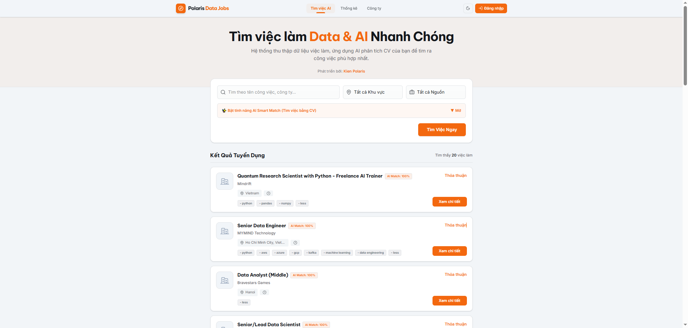
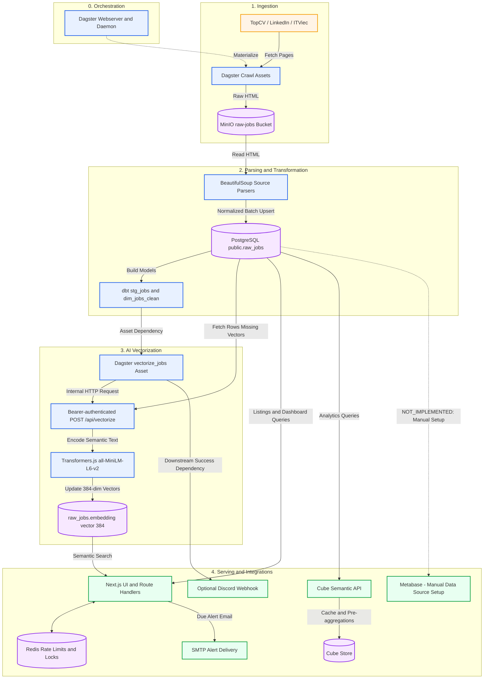
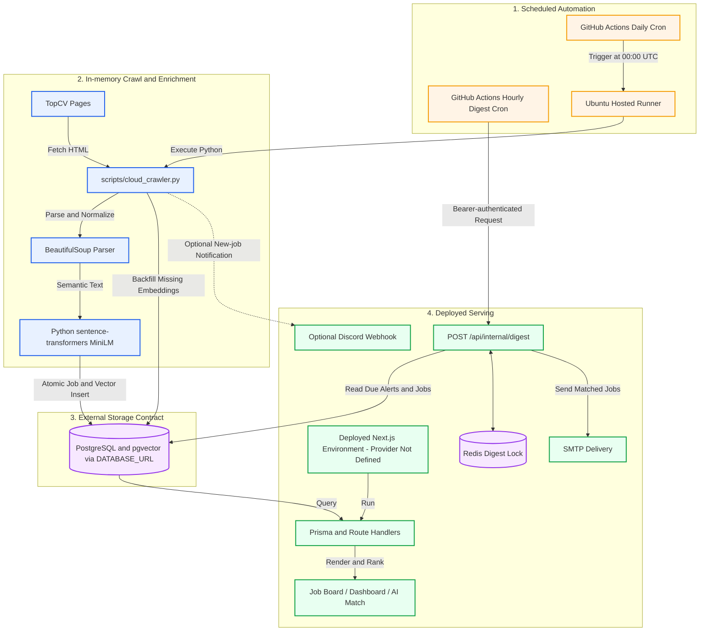
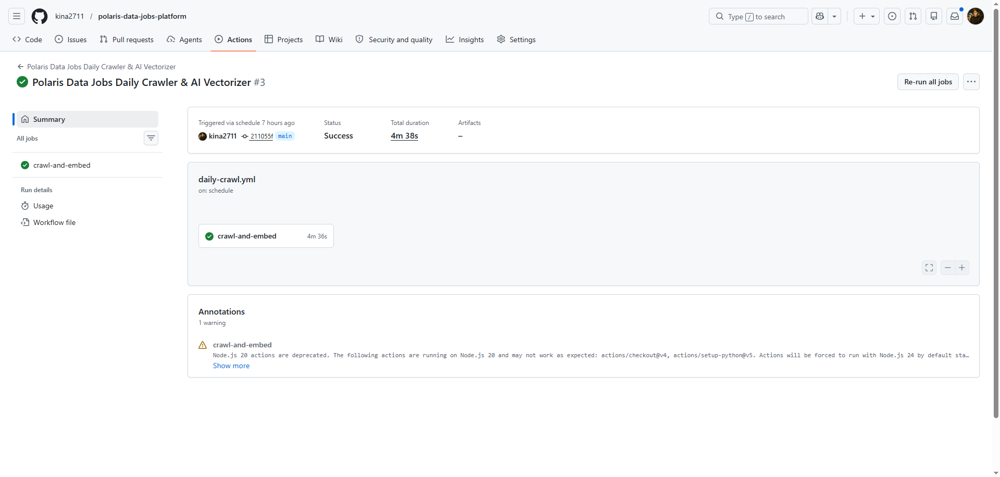

# Polaris Data Jobs Platform

<p align="center">
  
  
  
  
</p>

<p align="center">
  
  
  
  
</p>

<p align="center">
  
  
  
  
</p>

> From fragmented job pages to a traceable data stream that supports semantic
> search and tells the story of the Data and AI job market in Vietnam.

**Last local verification:** 17 July 2026. All nine Docker containers were
running, and the verification endpoints for the web application, Dagster,
Metabase, Cube, and MinIO returned HTTP 200. The business database was
intentionally reset and contained zero jobs at verification time.

Every screenshot in this README is an original asset already stored in the
repository. The images record earlier runs with populated data and must not be
interpreted as live metrics.



## The data story

A job vacancy usually begins as an HTML page controlled by a third party. Its
title, company, location, salary, experience, and description may follow a
different structure on every source. The page may change or disappear, and the
same vacancy may be crawled repeatedly.

Serving those pages directly would produce a list that is difficult to compare
and impossible to audit. The product would not be able to answer where a record
came from, what the original page contained, or which transformation changed it.

Polaris addresses that problem through a data journey with explicit ownership at
every boundary:

```text
Job page
→ preserve the raw HTML
→ parse and normalize source fields
→ upsert into the canonical job store
→ build analytical models
→ generate semantic vectors
→ serve search, dashboards, and alerts
```

The objective is not merely to crawl vacancies. Each layer answers a different
question:

| Question                                                   | Responsible layer                              |
| ---------------------------------------------------------- | ---------------------------------------------- |
| What did the source page contain when it was crawled?      | MinIO bucket `raw-jobs`                        |
| What is the current canonical job record?                  | PostgreSQL `public.raw_jobs`                   |
| Has the record been prepared for analysis?                 | dbt `stg_jobs` and `dim_jobs_clean`            |
| Which jobs are semantically closest to this CV?            | 384-dimensional MiniLM embeddings and pgvector |
| What does the user see?                                    | Next.js pages and route handlers               |
| Which assets processed the data?                           | Dagster lineage and run metadata               |
| How does the system avoid repeatedly sending the same job? | Redis lock, delivery cursor, and audit rows    |

## From source data to a product experience

### 1. Traceable ingestion

The active Dagster definitions implement three source branches: **TopCV,
LinkedIn, and ITViec**. Raw HTML is written to MinIO before a source parser
creates normalized records. A separate TopCV cloud crawler can also run daily
through GitHub Actions.


The asset graph illustrates the path from ingestion to parsing, PostgreSQL, dbt,
vectorization, and notifications. Exact asset names, functions, branches, and
error paths are documented in [the code-flow guide](docs/code-flow.md).

### 2. One source of truth for jobs

`public.raw_jobs` is the operational source of truth shared by the active
crawlers, dbt, the vectorizer, the web API, and Cube.

The upsert path preserves the first-seen timestamp, invalidates an embedding
only when semantic content changes, and persists batches transactionally. A
recrawl therefore does not make an old vacancy appear new, and a stale vector
cannot continue to represent an updated description.

The verified canonical fields are ID, title, company, location, salary,
experience, description, requirements, tags, source, URL, crawl timestamp, and
embedding. Category, level, logo, and original posting date do not exist in the
canonical schema. APIs return `null` or reject unsupported filters instead of
inventing those values.

### 3. Two ways to read the same data

- **Directed discovery:** keyword, location, and source filters pass through
  validation before a paginated PostgreSQL query.
- **Semantic discovery:** bounded CV text is embedded with MiniLM and compared
  with `raw_jobs.embedding` through cosine distance.
- **Market analysis:** the dashboard summarizes jobs, companies, sources,
  locations, crawl trends, and salary distributions from the canonical schema.
- **Change tracking:** the alert digest selects rows newer than its delivery
  cursor, acquires a Redis lock, sends through SMTP, and records an audit row.

### 4. Turning records into a market narrative

dbt builds rebuildable staging and mart layers. Cube exposes a semantic API and
uses a separate Cube Store outside development mode. Metabase is included in the
local stack, but provisioning a Polaris data-source connection remains a manual
administration step and is `NOT_IMPLEMENTED` in repository automation.

The original Metabase asset below recorded 234 jobs at capture time, including
location and experience distributions. That number belongs to the stored
snapshot and is not a live metric after the database reset.


## 🏗 System Architectures

The repository contains two active execution paths. They share the same
canonical PostgreSQL contract but serve different operational needs.

### 1. Local integrated architecture (Dagster and Docker Compose)

This is the full research and development stack. Dagster preserves raw source
evidence in MinIO, materializes the transformation lineage, and coordinates
vectorization and notification assets. Docker Compose also starts the serving,
semantic, and BI services.

**End-to-End Flow:**



1. **Orchestration:** Dagster loads the asset graph, resources, and dbt
   manifest. The daemon and webserver use the isolated `polaris_dagster`
   metadata database.
2. **Ingestion:** Source-specific assets fetch TopCV, LinkedIn, and ITViec pages
   and preserve raw HTML in the MinIO `raw-jobs` bucket.
3. **Parsing and transformation:** BeautifulSoup parsers normalize the source
   fields and transactionally upsert `public.raw_jobs`. dbt then builds
   `stg_jobs` and `dim_jobs_clean`.
4. **AI vectorization:** The Dagster `vectorize_jobs` asset calls the protected
   Next.js `/api/vectorize` endpoint. Transformers.js loads `all-MiniLM-L6-v2`,
   creates 384-dimensional vectors, and updates the pgvector column.
5. **Serving:** Next.js and Prisma serve job discovery, dashboards, semantic CV
   matching, and alerts. Redis provides rate-limit state and digest locks. Cube
   uses Cube Store for cache and pre-aggregations.
6. **Optional integrations:** Discord runs only when a webhook is configured.
   Metabase starts with its own application database, but the Polaris data
   source connection is not provisioned automatically.

### 2. Cloud automation architecture (GitHub Actions)

This path keeps scheduled ingestion and alert triggering independent from the
local Dagster stack. The repository does not prescribe a specific cloud vendor:
the target database is supplied through `DATABASE_URL`, and the deployed web
origin is supplied through `POLARIS_WEB_URL`.

**End-to-End Flow:**



1. **Daily trigger:** `daily-crawl.yml` starts an Ubuntu runner at 00:00 UTC or
   through manual dispatch.
2. **In-memory processing:** the runner executes `scripts/cloud_crawler.py`,
   fetches TopCV pages, normalizes new records, and creates embeddings with the
   Python `sentence-transformers` package.
3. **Direct persistence:** textual fields and vectors are written atomically to
   the PostgreSQL/pgvector target provided by `DATABASE_URL`. Raw HTML is not
   persisted to MinIO in this execution path.
4. **Deployed web:** any compatible Next.js deployment can query the same
   database through Prisma. No hosting provider, DNS name, or TLS platform is
   encoded in this repository.
5. **Hourly alerts:** `hourly-digest.yml` calls the deployed internal digest
   route with its own Bearer token. The route uses Redis locking, evaluates due
   alerts, sends SMTP email, and records the delivery result.

PostgreSQL `public.raw_jobs` is the canonical operational job store shared by
both architectures. The web application does not import Dagster code; the local
vectorization bridge is the authenticated internal HTTP endpoint.

### Database boundaries

| Database           | Owner    | Contents                                             |
| ------------------ | -------- | ---------------------------------------------------- |
| `crawl_jobs_db`    | Polaris  | Jobs, users, alerts, delivery audit, and dbt outputs |
| `polaris_dagster`  | Dagster  | Run, event, schedule, and daemon metadata            |
| `polaris_metabase` | Metabase | BI application metadata, not job records             |

Separating these databases prevents tool-owned migrations from changing the
business schema. MinIO and Redis also have distinct ownership: MinIO preserves
raw evidence, while Redis holds rate-limit state, distributed locks, and
short-lived run results.

## Technology stack and actual responsibilities

| Layer                  | Technology                                               | Responsibility in this repository                              |
| ---------------------- | -------------------------------------------------------- | -------------------------------------------------------------- |
| Product UI             | Next.js 15, React 19, TypeScript, Tailwind CSS, Recharts | Job discovery, company pages, market dashboard, and alert UI   |
| API and contracts      | Next.js route handlers, explicit validation, Prisma 6    | Health, match, alert CRUD, digest, and vectorization endpoints |
| Operational store      | PostgreSQL 15 and pgvector                               | Canonical jobs, application data, and vector similarity        |
| Raw storage            | MinIO                                                    | Source HTML grouped by source and job                          |
| Cache and coordination | Redis and ioredis                                        | Rate limiting, digest locks, and idempotent run results        |
| Orchestration          | Dagster                                                  | Asset graph, resources, runs, and scheduling boundaries        |
| Transformation         | dbt-postgres                                             | `stg_jobs` and `dim_jobs_clean`                                |
| Crawling               | Python, BeautifulSoup, curl-cffi                         | Fetch, parse, normalize, and upsert                            |
| Embeddings             | `all-MiniLM-L6-v2`                                       | 384-dimensional vectors for semantic matching                  |
| Semantic and BI        | Cube, Cube Store, Metabase                               | Semantic API and dashboard tooling                             |
| Automation             | Docker Compose and GitHub Actions                        | Local stack, CI, daily crawl, and hourly digest                |

Dependency versions come from [`apps/web/package.json`](apps/web/package.json),
[`data/dagster/requirements.txt`](data/dagster/requirements.txt), and
[`docker-compose.yml`](docker-compose.yml), rather than from marketing copy.

## Product request flows

### Crawl and normalization

```text
Dagster asset
→ HTTP client with timeout and retry
→ MinIO raw HTML
→ source-specific parser
→ normalized job dictionary
→ transactional raw_jobs upsert
→ optional Discord notification
```

### Semantic CV matching

```text
User submits CV text
→ POST /api/match
→ validation and rate limiting
→ MiniLM embedding
→ pgvector cosine distance and supported filters
→ paginated ranked jobs
→ UI result state
```

### Alert digest

```text
Hourly workflow
→ Bearer-authenticated internal endpoint
→ Redis distributed lock
→ due alerts
→ supported filters only
→ SMTP delivery
→ delivery audit and cursor
→ cached run result
```

The complete happy paths, failure branches, participating functions, and data
contracts are documented in [`docs/code-flow.md`](docs/code-flow.md). HTTP
request and response contracts are documented in [`docs/api.md`](docs/api.md).

## Original repository screenshots

### Scheduled crawler



The workflow screenshot shows a successful daily crawler run. The current
workflow definition is
[`.github/workflows/daily-crawl.yml`](.github/workflows/daily-crawl.yml).

### Pipeline notification


The Discord screenshot illustrates notification output at capture time. The bot
name and job rows are historical; the current contract must be read from code.

| Asset                                             | What it demonstrates                                  |
| ------------------------------------------------- | ----------------------------------------------------- |
| [Web portal](docs/web_portal.png)                 | Job cards, filters, and semantic-match UI             |
| [Dagster graph](docs/dagster_graph.png)           | End-to-end asset lineage                              |
| [Metabase dashboard](docs/metabase_dashboard.png) | Market distributions from the stored 234-job snapshot |
| [GitHub Actions](docs/github_actions.png)         | A scheduled cloud-crawler run                         |
| [Discord alert](docs/discord_alert.png)           | Pipeline notification output                          |

Screenshots only demonstrate the UI or state at capture time. Current code,
schema, migrations, and configuration remain the source of truth.

## Run the platform locally in five steps

### 1. Prerequisites

- Docker Desktop with Docker Compose v2.
- At least 25 GB of available disk space is recommended for images, layers, and
  build cache. A complete local build approached 20 GB before cache cleanup.
- Node.js 20 and Python 3.10+ are required only for quality checks outside the
  containers.

### 2. Create local environment files

```powershell
Copy-Item .env.example .env
Copy-Item apps/web/.env.example apps/web/.env.local
```

Replace every placeholder secret. Never commit `.env`, webhook URLs, SMTP
credentials, or internal tokens. The complete variable contract is in
[`docs/development.md`](docs/development.md).

### 3. Validate, build, and start

```powershell
docker compose config --quiet
docker compose build
docker compose up -d
docker compose ps
```

### 4. Initialize migration history for a fresh volume

The initialization SQL creates a schema compatible with the historical Prisma
baseline but does not fabricate Prisma migration history. Run these commands
once for a fresh PostgreSQL volume:

```powershell
docker compose exec -T web npx prisma migrate resolve --applied 20260422140000_jobs_baseline
docker compose exec -T web npx prisma migrate deploy
docker compose exec -T web npx prisma validate
```

For a database that already has migration history, run only
`prisma migrate deploy`. Do not use `prisma db push` in shared or production
environments.

### 5. Open the services

| Service     | URL                     | Health or verification path           |
| ----------- | ----------------------- | ------------------------------------- |
| Polaris web | <http://localhost:3400> | `/api/health`                         |
| Dagster     | <http://localhost:3000> | UI and definitions load               |
| Metabase    | <http://localhost:3001> | `/api/health`                         |
| Cube        | <http://localhost:4000> | `/readyz`                             |
| MinIO       | <http://localhost:9001> | API `/minio/health/live` on port 9000 |
| PostgreSQL  | `localhost:5432`        | Compose health check                  |
| Redis       | `localhost:6379`        | Compose health check                  |

Metabase may need several minutes to finish its first migration. Connecting
Metabase to the Polaris business database is not automated.

Use `docker compose down` to stop the stack. Volume deletion is deliberately
excluded from normal operating instructions because it destroys local state.

## Direct web development

```powershell
Set-Location apps/web
Copy-Item .env.example .env.local
npm ci
npm run db:validate
npm run dev
```

The development server listens on port `3400`. A PostgreSQL database with
pgvector matching `DATABASE_URL` must already be available.

## Standalone cloud crawler

```powershell
python -m pip install -r scripts/requirements.txt
$env:DATABASE_URL = 'postgresql://...'
python scripts/cloud_crawler.py
```

The crawler discovers TopCV URLs, removes known IDs before applying the batch
limit, generates embeddings, atomically inserts new rows, and backfills a
bounded number of missing vectors. An embedding failure fails the run rather
than writing incomplete new records.

## Quality gates

Run the web checks from `apps/web/`:

```powershell
npm ci
npm run format:check
npm run lint
npm run typecheck
npm test
npm run build
```

Run Python, data, and Compose checks from the repository root:

```powershell
python -m compileall -q data/dagster scripts legacy/airflow/airflow
python -m ruff check data/dagster scripts legacy/airflow/airflow
python -m unittest discover -s data/dagster/tests -p "test_*.py"
docker compose config --quiet
docker compose exec -T dagster_webserver sh -lc "cd /opt/dagster/app/dbt_project && dbt parse --profiles-dir ."
docker compose exec -T dagster_webserver dagster definitions validate -m crawl_pipeline
```

On 17 July 2026, 19 web tests and 2 Python tests passed. ESLint, TypeScript,
Prettier, Ruff, Prisma validation, dbt parse, and Dagster definition validation
also passed.

## Repository structure

```text
.
|-- apps/web/                 Next.js UI, APIs, and Prisma schema/migrations
|-- data/
|   |-- dagster/              Assets, resources, tests, and dbt project
|   |-- postgres/init/        Fresh-volume schema and service databases
|   `-- semantic/             Cube model and configuration
|-- docs/                     Architecture, flows, runbooks, and image assets
|-- experiments/manual/       Explicit manual smoke scripts
|-- legacy/airflow/           Archived Airflow and Trino implementation
|-- scripts/                  Standalone cloud crawler
|-- .github/workflows/        CI, daily crawl, and hourly digest
`-- docker-compose.yml        Integrated local stack
```

Generated Dagster, dbt, Cube, Python, Next.js, and BI cache data is ignored.

## Known limitations

- `NOT_IMPLEMENTED`: NextAuth has no provider. Login, account, and alert UI
  require an approved Polaris identity-provider contract.
- `NEEDS_CONFIRMATION`: user provisioning and synchronization into `public.User`
  are outside this repository.
- SMTP acceptance and the following delivery transaction cannot be perfectly
  atomic. A database failure after SMTP acceptance can produce an at-least-once
  retry.
- The dashboard converts USD salary buckets for display using 25,000 VND/USD.
  This is `NEEDS_CONFIRMATION` and is not a financial exchange-rate source.
- dbt salary normalization is intended for basic analysis, not authoritative
  compensation or financial calculations.
- Crawlers depend on third-party HTML and require periodic selector review.
- Metabase data-source provisioning and production DNS, TLS, and backup
  automation are not defined in the repository.
- `legacy/airflow/` is reference-only and is not loaded by the root Compose file
  or active CI flow.

## Documentation map

| Document                             | Scope                                             |
| ------------------------------------ | ------------------------------------------------- |
| [Architecture](docs/architecture.md) | Components, boundaries, and dependency direction  |
| [Code flow](docs/code-flow.md)       | End-to-end happy and error paths                  |
| [API](docs/api.md)                   | Route contracts, authentication, and status codes |
| [Database](docs/database.md)         | Schema, ownership, and migrations                 |
| [Development](docs/development.md)   | Local setup, environment, and conventions         |
| [Deployment](docs/deployment.md)     | Compose and GitHub Actions rollout                |
| [Contributing](CONTRIBUTING.md)      | Change and review rules                           |
| [Changelog](CHANGELOG.md)            | Notable changes                                   |
| [License](LICENSE)                   | MIT terms and warranty disclaimer                 |

## License

The original Polaris source code and documentation in this repository are
licensed under the [MIT License](LICENSE).

The root license does not relicense third-party job-posting content, company
names, trademarks, service screenshots, or other externally owned material.
Files or subtrees that contain their own license or copyright notice retain
those terms; in particular, `legacy/airflow/` includes a separate MIT notice for
its original copyright holder.

## Quick troubleshooting

- `vector extension is not available`: use a PostgreSQL image or provider with
  pgvector, then apply the initialization SQL or migrations.
- `/api/vectorize` returns `401`: synchronize `INTERNAL_VECTORIZER_TOKEN`
  between Dagster and the web application.
- Digest returns `503 lock_unavailable`: inspect Redis. The flow deliberately
  fails closed to avoid duplicate email.
- Dagster reports a missing manifest: run `dbt parse` from
  `data/dagster/dbt_project/`.
- Metabase returns `503 initializing`: wait for
  `Metabase Initialization COMPLETE` in its logs.
- Cube `/readyz` returns `500`: inspect Cube Store and `CUBEJS_CUBESTORE_HOST`.

Contributions must preserve verified business contracts, add tests for logic
changes, and update documentation together with code. See
[`CONTRIBUTING.md`](CONTRIBUTING.md).
