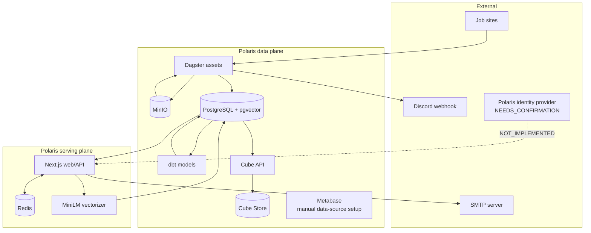

# Architecture

## System boundary

Polaris owns ingestion of job pages, normalization into `public.raw_jobs`,
vector enrichment, job discovery, analytics, and alert definitions/delivery.
Third-party job portals, SMTP, Discord, and any identity provider are external
systems.

## Component map



## Runtime entry points

| Entry point                               | Responsibility                                         |
| ----------------------------------------- | ------------------------------------------------------ |
| `docker-compose.yml`                      | Starts the integrated local stack.                     |
| `data/dagster/crawl_pipeline/__init__.py` | Registers Dagster assets/resources.                    |
| `data/dagster/workspace.yaml`             | Loads the `crawl_pipeline` package.                    |
| `apps/web/src/app/`                       | Next.js App Router pages and route handlers.           |
| `apps/web/src/auth.ts`                    | NextAuth configuration; providers are not implemented. |
| `scripts/cloud_crawler.py`                | Standalone scheduled TopCV crawler/vectorizer.         |
| `.github/workflows/daily-crawl.yml`       | Daily cloud crawler schedule.                          |
| `.github/workflows/hourly-digest.yml`     | Hourly due-alert trigger.                              |

## Data ownership

- `public.raw_jobs`: canonical job rows, written by active Dagster parsers and
  the cloud crawler; embeddings are written by vectorizers.
- `public.User`: read by the web alert flow. Creation/synchronization is owned
  by the future approved Polaris IdP (`NEEDS_CONFIRMATION`).
- `public.JobAlert`: owned by the web application.
- `public.JobAlertDelivery`: append-only delivery audit owned by the web app.
- MinIO bucket `raw-jobs`: raw HTML owned by Dagster ingestion.
- dbt `stg_jobs`/`dim_jobs_clean`: derived, rebuildable models.
- `polaris_dagster`: Dagster run/event/schedule metadata, isolated from the
  business schema through `data/dagster/dagster.yaml`.
- `polaris_metabase`: Metabase application metadata only. A Polaris analytics
  data-source connection is `NOT_IMPLEMENTED` and must be configured by an
  administrator.

## Dependency direction

```text
Crawler adapters → shared HTTP/storage helpers → external sites/MinIO
Parser assets → raw_jobs persistence helper → PostgreSQL
dbt assets → raw_jobs source → derived models
Web routes/pages → lib services → Prisma/Redis/SMTP
Internal scheduler → authenticated web route → domain filter/email logic
```

The web application does not import Dagster code. Both communicate through
PostgreSQL and the authenticated vectorizer HTTP endpoint.

## Security boundaries

- `/api/vectorize` and `/api/internal/digest` use separate Bearer tokens.
- Alert writes require a session plus same-origin validation.
- Match requests are bounded, rate-limited, and use parameterized Prisma SQL.
- Redis TLS certificate verification is enabled by default.
- Cube uses its built-in API-secret verification. `CUBEJS_DEV_MODE=true` is for
  isolated local use only.
- Discord and SMTP credentials are environment values, never source constants.

## Legacy boundary

`legacy/airflow/` contains a previous Airflow/Trino/dbt/Power BI design. It is
not loaded by the root Compose stack and is not a dependency of active code.
Clear correctness defects can be repaired, but migrations from this tree into
the active architecture require a separate business decision.
