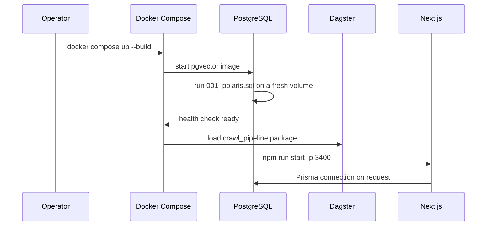
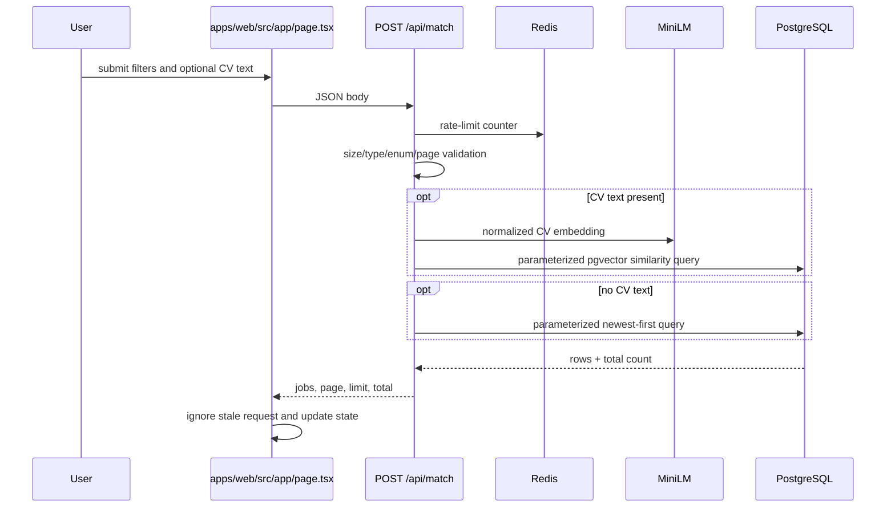

# Code flows

## 1. Local application startup



- Success: required containers start; `/api/health` returns `200` when the DB is
  reachable. Redis is reported separately and is optional for read caching.
- Failure: PostgreSQL health blocks dependent services. Missing Dagster dbt
  manifest fails the image build because `dbt parse` is not suppressed.

## 2. Dagster ingestion

```text
Materialize source search asset
→ build curl-cffi session
→ fetch search HTML with bounded retries
→ store dated HTML in MinIO raw-jobs
→ discover and deduplicate detail URLs
→ fetch detail HTML and store in MinIO
→ parse fields with BeautifulSoup
→ atomically upsert a batch into PostgreSQL raw_jobs
→ emit materialization metadata
```

Files:

- `data/dagster/crawl_pipeline/assets/ingestion/*_assets.py`
- `data/dagster/crawl_pipeline/utils/http_client.py`
- `data/dagster/crawl_pipeline/utils/raw_jobs.py`
- `data/dagster/crawl_pipeline/resources/{minio,postgres}_resource.py`

Branches and errors:

- Empty list/detail pages produce zero-row metadata instead of invented rows.
- HTTP retries log the URL, attempt, and final error.
- The batch upsert is one database transaction. It preserves the first-seen
  `crawled_at` timestamp and invalidates an existing embedding only when title,
  experience, description, or requirements change.
- Selector drift can yield empty fields. Required-field business validation is
  `NEEDS_CONFIRMATION` because no authoritative field contract exists.

## 3. dbt transformation and vectorization

```text
raw_jobs
→ dbt source public.raw_jobs
→ stg_jobs view
→ dim_jobs_clean table
→ Dagster ai/vectorize_jobs asset
→ POST /api/vectorize with Bearer token
→ scripts/vectorize.js selects up to 500 missing embeddings
→ MiniLM 384-dim vectors
→ parameterized UPDATE raw_jobs
→ notification/discord_notification (optional webhook)
```

- A missing vectorizer token, HTTP failure, timeout, or any per-job embedding
  failure marks the asset failed.
- The Discord asset depends on successful vectorization. Missing webhook skips;
  a configured webhook failure marks notification failed.

## 4. Search and AI match



- Input limits: 64 KB HTTP body, 40,000 CV characters, 120 filter characters,
  page `1..1000`, and approved sources only.
- A production request with no trustworthy client IP uses one strict shared
  fallback bucket. Configure trusted proxy headers for per-client limits.
- `category`, `level`, logo, and original posted date are `null` because the
  canonical table does not contain those fields.

## 5. Job alert CRUD

```text
Authenticated UI action
→ same-origin write check
→ NextAuth session/user ID
→ JSON validation and filter sanitization
→ serializable per-user quota transaction (maximum 5)
→ JobAlert insert/update/delete
→ response → UI refresh or visible error
```

Files: `apps/web/src/app/api/alerts/`, `src/lib/alert-match.ts`,
`src/lib/validation.ts`, and alert components.

`NOT_IMPLEMENTED`: there is no provider in `src/auth.ts`, so this flow cannot be
used until a Polaris IdP is configured.

New alerts accept only `keyword`, `location`, and `salary`. Category, role,
experience, and level are rejected because `raw_jobs` cannot evaluate them.

## 6. Alert digest

```text
GitHub hourly schedule
→ POST /api/internal/digest with Bearer token
→ Redis NX lock scoped by environment/hour
→ load active alerts and users
→ select alerts due at 08:00 in each IANA timezone
→ skip and log legacy alerts that contain unsupported filters
→ read raw_jobs after each alert's delivery cursor
→ sanitize filters and match in process
→ SMTP email (maximum 10 jobs)
→ transaction: update cursor/lastSentAt + append delivery audit
```

- New alerts wait one hour before their first digest.
- Legacy alerts containing category, role, experience, or level are skipped and
  logged; users must recreate them with supported fields.
- A 23-hour guard prevents repeat daily delivery.
- If a scanned window has no match, its cursor advances so a backlog over 10,000
  rows does not permanently block later jobs.
- Redis failure returns `503` (fail closed) to avoid duplicate concurrent mail.
- SMTP failure leaves the cursor unchanged and increments `emailsFailed`.
- Residual risk: SMTP acceptance followed by a database transaction failure can
  cause an at-least-once retry; those systems cannot share one transaction.

## 7. Cloud crawler

```text
Daily GitHub schedule/manual dispatch
→ require DATABASE_URL
→ discover TopCV URLs with retries
→ compare sorted IDs with raw_jobs before the 40-row cap
→ crawl/parse new details
→ load MiniLM only when new or missing vectors exist
→ generate and validate 384-dim embeddings
→ transactional parameterized INSERT ... ON CONFLICT DO NOTHING
→ backfill up to 100 NULL embeddings
→ optional bounded Discord notification
```

An embedding error fails the workflow before new incomplete rows are inserted.

## 8. Legacy Discord flow

```text
Airflow task → query unposted rows → send each Discord embed
→ collect only successfully sent URLs → update posted_to_discord for those URLs
```

This archived flow is not scheduled by the active root deployment.
